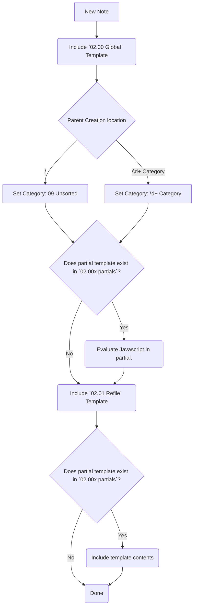

# Template flow

When a new note is created it automatically includes the [[02.00 Global]] template which has a few roles. This template discovers what category the note was filed under and sets a category in the context. This is usually discovered by automatically including the partial which matches the category ID. Initially only the javascript within the partial is included, this lets the partial refile the note into the correct category before including the template if the category in the template and the category discovered from the folder the note was created in mismatch. With this context the global template includes the [[02.01 Refile]] template which stores the note in the correct folder  and lastly we add in the content of the partial template for the found category.

## Diagram

## New Notes
All new notes automatically file themselves into `09x` which includes the [[09 Unsorted]] template. This template's sole responsibility is to unset the automatically discovered category id based on [[02.00 Global]]. The [[02.01 Refile]] template will ask where to refile the note and move the note out of `09x` and into the appropriate category where [[02.00 Global]] then adds the template for the new category if a partial exists within `02.00x partials`.

# Special Options

When creating new templates, there are a few options which can be set to influence the behaivor of the refiling process. All of these options are by setting flags on the `tp.opts` object in the partial templates. The keys and what they do are described below.

- `tp.opts.title`: Do not ask for a note name and use the string within this option instead.
- `tp.opts.category`: Use this Abstract Category instead of asking for an Abstract Category. Setting this to false will force a prompt for selecting an Abstract Category.
- `tp.opts.acid`: Hardcode the Abstract Category and Note ID to the given string. This makes the note's ID immutable and further attempts to refile the note will result in no changes.
- `tp.opts.permanent`: Automatically sets `tp.opts.acid` to the `acid` that is created for the new note. This also makes the note's ID immutable as if `tp.opts.acid` were originally set.
- `tp.opts.frontmatter`: Add frontmatter to the note that is created. This should be an object.